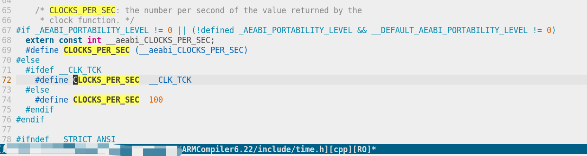
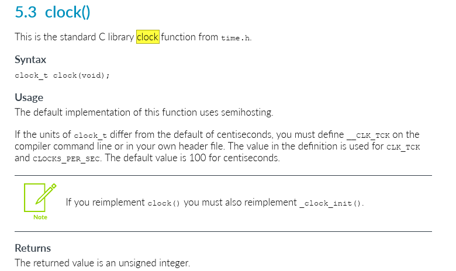

# function descript
clock() return a tick means cpu tick, it only means a cpu tick count, no other means, it differ with your implementation, this count maybe a count down tick, or count up tick.

usually we get 2 times before and after target code. and make a diff, and use this count value to divide **CLOCKS_PER_SEC** to get the second it used.

----
**CLOCKS_PER_SEC** usually is a macro in <time.h>, and <time.h> is a common file in compiler library. differert library will have different code when reference it.

## armclang
in armclang, **CLOCK_PER_SEC** is default set as 100, if we need change it, need define **__CLK_TCK** in compiler cmd

it same with armclang libraries_user_guide

## gcc
TBD

## ref:
[菜鸟教程：clock库函数](https://www.runoob.com/cprogramming/c-function-clock.html)

