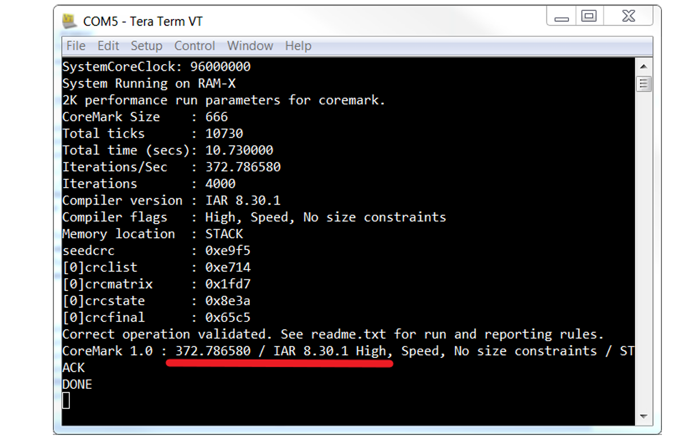

# CoreMark移植
## GitHub
https://github.com/eembc/coremark

## arm官方参考
[ARM Coremark porting guide](https://developer.arm.com/documentation/106383/a/?lang=en)

## File List
按照readme的说明，针对baremetal这种无OS的情况
主要依赖的是以下文件
```
core_list_join.c
core_main.c
core_matrix.c
core_state.c
core_util.c
PORT_DIR/core_portme.c
```
copy的时候记得连同同文件夹下面的.h文件一起copy  

## RTL 仿真次数选择
由于RTL仿真耗时较久，不能跑很多轮，只能按照对应的仿真速度来做决定.
参考最下面的NXP的CM33的Iteration/Sec数值，算出来大概1轮消耗多少时间，然后再根据自己的仿真速度，来决定跑多少轮
## RTL 仿真相关修改
core_main.c.  
- 把main函数名改成case名字，去调用，防止于原本的main函数冲突
- 修改时间检查相关逻辑，确保循环次数比较小也可以出结果  
  如下，可以屏蔽secs检查避免报错
```C
#if HAS_FLOAT
    ee_printf("Total time (secs): %f\n", time_in_secs(total_time));
    if (time_in_secs(total_time) > 0)
        ee_printf("Iterations/Sec   : %f\n",
                  default_num_contexts * results[0].iterations
                      / time_in_secs(total_time));
#else
    ee_printf("Total time (secs): %d\n", time_in_secs(total_time));
    if (time_in_secs(total_time) > 0)
        ee_printf("Iterations/Sec   : %d\n",
                  default_num_contexts * results[0].iterations
                      / time_in_secs(total_time));
#endif
    if (time_in_secs(total_time) < 10)
    {
        ee_printf(
            "ERROR! Must execute for at least 10 secs for a valid result!\n");
        total_errors++;
    }
```

core_portme.c
- clock() 函数适配
  在start_time, end_time函数中，会用clock来获取时间.
  clock适配可以参考[20250228_clock.md](./20250228%20clock.md)这里做相关了解.  
  对于armclang来说，主要是要自己实现一个clock_t clock(void)函数. 如果有相关init函数，可以再实现一个__clock_init()函数.
- get_time()函数适配
  我这边使用的systick的tick值做的clock()函数的返回值，其是递减的，所以要用start-end的值作为差值，而不是原本的end-start

coremark.h
- include print重定向的头文件，防止链接到lib库自带的print实现. 
 
makefile
- armclang编译宏，定义clock频率：-D__CLK_TCK=XXXXXX
- 编译宏，定义循环次数: -DITERATIONS=x
- c文件添加，相关头文件路径也要添加:-Ixxx


# Reference
## ARM
- [ARM Coremark porting guide](https://developer.arm.com/documentation/106383/a/?lang=en)

- [ARM cortex-M series performance compare](https://developer.arm.com/compare-ip/#cortex-m-cpu-performance---scalar)
  

- [ARM cortex-M series comparison table](https://developer.arm.com/documentation/102787/0300/?lang=en)
  
## NXP

[PDF link](https://www.nxp.com/docs/zh/application-note/AN12284.pdf)

result:  
